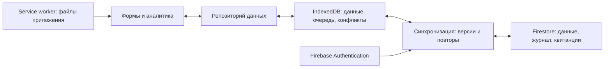

# finance-v2: ядро финансового приложения

Статус на 2026-09-14: этап 1 завершён — реализованы деньги, даты, счета, категории, расходы, локальная проекция, очередь и атомарное сохранение через IndexedDB; повторное открытие реальной IndexedDB проверено пользователем. Реализован провайдер-независимый цикл синхронизации с hash, квитанциями, последовательным pull, потерянным ответом и сохранением конфликтов; он проверен на детерминированном имитаторе. Firebase Emulator, правила и новый интерфейс пока не реализованы. Технический контракт вынесен в [синхронизацию](finance-v2-sync.md).

## Зафиксированные решения

Приоритет пользователя — быстрое бесплатное хранилище от устойчивого поставщика, отдельные пользователи, расходы и настраиваемые категории. Google Таблица перестаёт быть обязательной частью новой архитектуры. Разработка продолжается в отдельном локальном форке; нынешнее приложение сохраняется.

| Вопрос | Предлагаемое решение |
| :--- | :--- |
| Серверное хранилище | Google Cloud Firestore, план Firebase Spark. Проверить прототипом до подключения реальных данных. |
| Учётные записи | Firebase Authentication, сначала вход через Google. У каждого пользователя свои данные. |
| Локальная работа | IndexedDB: подтверждённые данные, локальные изменения, очередь отправки и конфликты. |
| Приоритет функций | Расходы и категории → счета и переводы → бюджеты и накопления. Счёт как сущность нужен уже для первого расхода. |
| Валюты | В модели сразу несколько валют; в первом выборе RUB, USD, EUR. Полный каталог и поиск позже. |
| Категории | Название, цвет и стабильный идентификатор иконки. Большая библиотека и поиск по русским названиям. |
| Интерфейс | Сохранить существующие темы и компоненты; сначала отделить данные от форм, затем добавлять нужные формы. |
| Клиентская технология | Семантический HTML, обычный CSS и нативные ES-модули JavaScript. UI-фреймворк и библиотека компонентов не используются. |
| Форматы выпуска | Сначала обычное веб-приложение, затем устанавливаемая PWA; будущая APK-оболочка не меняет финансовое ядро и хранилища. |
| Публикация | Статическая сборка не зависит от GitHub Pages. Исходный репозиторий можно держать закрытым и менять хостинг без переделки приложения. Сейчас только локальная работа. |

## Исходная точка

Локально проверено: чистый `main` исходного проекта, `HEAD = origin/main = 92738ea`; `origin/main` — сохранённая локальная ссылка, без обновления с GitHub. Тег `pre-global-update-2026-09-14` указывает на `b9a1b7f`, является предком `main`. Все **116 тестов** и `npm run check` прошли.

По коду: [api.js](../api.js) отправляет изменения на Apps Script и ожидает ответ до 45 секунд; [app.js](../app.js) держит финансовую модель в памяти. [pwa.js](../pwa.js) обслуживает установку приложения без service worker. Сервер сравнивает общую ревизию данных, а доходы уникальны по паре «источник + месяц». Полноценной офлайн-очереди нет.

Версия развёртывания 7, включённые копии Drive и контрольные 4 источника / 66 записей известны из handoff. В этом этапе облачный сервер и частные копии повторно не читались. Число `version: 4` в `doGet()` — версия ответа старого API, оно не проверяет номер развёртывания Apps Script.

## Почему Firestore

| Вариант | Соответствие этой задаче |
| :--- | :--- |
| **Firestore + Firebase Auth** | Предпочтительный вариант: инфраструктура Google, отдельные пользователи, транзакции и прямой доступ через клиентский SDK. Отдельный вычислительный сервер для первого ядра не требуется. |
| Supabase / PostgreSQL | Удобнее для сложных SQL-отчётов и серверной логики. На Free проект может приостанавливаться после недели низкой активности; автоматические копии не включены. Это хуже соответствует ожиданию постоянно доступного бесплатного приложения. [Условия Supabase](https://supabase.com/pricing). |
| Apps Script + Google Sheets | Оставить нынешнему приложению. Новому ядру пришлось бы самостоятельно добавлять изоляцию пользователей, журнал изменений и протокол атомарных записей поверх таблицы. |

На дату проверки бесплатная квота Firestore: **1 GiB**, **50 000 чтений**, **20 000 записей** и **20 000 удалений документов в сутки**, **10 GiB исходящего трафика в месяц**. Квота общая для проекта, а не для каждого пользователя. Штатные резервные копии и восстановление требуют включённой оплаты. [Условия Firestore](https://firebase.google.com/docs/firestore/pricing).

Предлагается оставаться на Spark без платёжного аккаунта. При исчерпании квоты приложение сохраняет локальные изменения и приостанавливает синхронизацию. Бесплатность не означает неограниченную нагрузку или обещание неизменных условий на десятилетия. Cloud Functions не включать в обязательную цепочку: для них нужен Blaze с платёжным аккаунтом. [Планы Firebase](https://firebase.google.com/docs/projects/billing/firebase-pricing-plans), [требования Cloud Functions](https://firebase.google.com/codelabs/firebase-cloud-functions).

Быстрота интерфейса обеспечивается чтением и записью на устройстве. Задержка Firestore ещё не измерялась; выбор европейского расположения базы и измерение синхронизации входят в проверку прототипа. Нельзя представлять ожидаемое ускорение как уже полученный результат.

## Общая схема

Сохранение в интерфейсе подтверждается после завершения локальной транзакции. Отдельный статус показывает, дошли ли изменения до сервера. Онлайн-режим проходит тем же путём через IndexedDB и очередь: второго способа записи напрямую из формы нет.

Локальная база обслуживает интерфейс; подтверждённая версия Firestore служит общей точкой согласования устройств. Очередь содержит ещё не подтверждённые намерения пользователя. Балансы и отчёты вычисляются из записей, включая явно отмеченные локальные изменения.

## Модель данных

У каждой синхронизируемой сущности есть `id`, `version`, `createdAt`, `updatedAt`, `deletedAt` и `lastOpId`. ID создаётся на устройстве до отправки и не используется повторно. `version` меняется при серверном подтверждении; локальные изменения имеют отдельную последовательность. Книга хранит `schemaVersion`, `activeEpoch`, `headSeq`, настройки валют и дату начала подробного учёта.

| Сущность | Основные поля | Правило |
| :--- | :--- | :--- |
| `accounts` | `name`, `kind`, `currency`, `archivedAt` | Наличные, банковский или накопительный счёт. Валюта неизменна после появления операций. |
| `categories` | `name`, `kind`, `iconId`, `color`, `sortOrder`, `archivedAt` | Для первой версии плоский список, прежде всего категории расходов. Архивирование сохраняет историю. |
| `sources` | `name`, `color`, `active`, `sortOrder`, `archivedAt` | Источник дохода сохраняется отдельной сущностью. Это не расходная категория. |
| `transactions` | `kind`, `date`, суммы и ссылки в зависимости от типа, `note` | Каждое фактическое движение — отдельная запись. Несколько операций в один день или месяц допустимы. |
| `legacyIncomeMonths` | `sourceId`, `month`, `amountMinor`, `currency`, `legacyKey`, `legacyDeletedAt` | История месячных итогов v1. Не участвует в остатках счетов. |
| `budgets` | `month`, `currency`, `scope`, `categoryId?`, `limitMinor` | Уникальность по месяцу, валюте и области бюджета. |
| `goals` | `name`, `currency`, `targetMinor`, `targetDate?`, `status` | Цель накопления; сумма накопленного вычисляется по резервам. |
| `goalAllocations` | `goalId`, `accountId`, `allocatedMinor` | Один резерв на пару «цель + счёт», в одной валюте. Сам по себе не перемещает деньги. |

Суммы — целые минимальные денежные единицы. Для RUB, USD, EUR масштаб равен 2, но он находится в справочнике валют, а не зашит в расчёты. Проверять безопасный целочисленный диапазон у отдельных сумм и итогов; парсить десятичный ввод без арифметики с дробными денежными значениями.

Разные валюты не складываются в общий денежный итог. До появления явной модели курсов показывать суммы по валютам. Масштаб и список валют расширяются без переписывания операций. Имена и значки валют не служат ключами.

Дата операции — календарная строка `YYYY-MM-DD` с проверкой существования даты; месяц — `YYYY-MM`. Не преобразовывать дату операции через UTC. Серверные времена изменения — отдельные метаданные. Для книги по умолчанию предложить `Asia/Tbilisi`.

### Типы операций и расчёты

| Тип | Поля суммы и ссылок | Влияние |
| :--- | :--- | :--- |
| Доход | `accountId`, `amountMinor > 0`, `sourceId` | Увеличивает счёт и доход. При отсутствии выбора используется системный источник «Другие доходы». |
| Расход | `accountId`, `amountMinor > 0`, `categoryId` | Уменьшает счёт, увеличивает расход и использование бюджета. |
| Возврат расхода | `accountId`, `amountMinor > 0`, `refundOf` | Увеличивает счёт, уменьшает расход по категории исходной покупки в месяце возврата. Не становится доходом. |
| Перевод | `fromAccountId`, `toAccountId`, `fromAmountMinor`, `toAmountMinor` | Одна сущность со списанием и зачислением. Доход, расход и бюджет не меняются. |
| Начальный остаток | `accountId`, `deltaMinor` | Задаёт остаток на дату начала учёта. Не создаёт доход. |
| Корректировка | `accountId`, `deltaMinor`, `reason` | Исправляет остаток отдельной объяснимой записью; исключена из доходов и расходов. |

Первый интерфейс переводов поддерживает одинаковую валюту счетов и равные суммы сторон. Поля для двух сумм уже предусмотрены; обмен валют позднее вводит обе фактические суммы без скрытого курса. Комиссия — отдельный расход. Перевод между одним и тем же счётом запрещён.

Остаток счёта = начальный остаток + входящие движения − исходящие движения + корректировки. Накопленная сумма доходов v1 в эту формулу не подставляется. Начальный остаток уникален для счёта; движения до даты начала подробного учёта требуют отдельной миграции исходного остатка.

Нулевые фактические движения не создавать. Историческая запись с суммой `0` сохраняется: в v1 она отличается от отсутствующего месяца. Частичные возвраты должны ссылаться на расход; суммарный возврат не превышает его сумму. Изменение или удаление покупки с возвратами требует согласованного изменения связанного набора.

Удаление операции создаёт запись об удалении с новой версией. Архивирование источника, категории или счёта не удаляет движения и не меняет прошлые итоги. Отрицательный остаток показывается явно и сам по себе не запрещает записать реальный расход.

### Категории и иконки

В первой рабочей форме расхода нужны: дата, сумма, счёт, категория и необязательная заметка. Создание категории доступно из выбора категории; настройки включают название, иконку и цвет.

Начальный каталог выбора — минимум 150 локальных SVG-иконок: еда, дом, покупки, транспорт, здоровье, образование, работа, путешествия, развлечения и финансы. Во время работы приложение не загружает библиотеку иконок или CDN. Происхождение и лицензия каждого внешнего набора фиксируются при добавлении; при собственных иконках внешней зависимости нет.

В данных хранить `iconId`, например `lucide:shopping-basket`. SVG берётся из локального реестра, а не из произвольного текста или URL в базе. Поиск использует русские названия и синонимы; неизвестный ID отображается нейтральной иконкой. Каталог должен работать офлайн. Стабильная системная категория «Без категории» позволяет быстро записать расход и распределить его позже.

### Бюджеты и накопления

Первый бюджет — месячный лимит по категории и валюте; дополнительно возможен общий лимит по валюте. `spent = expenses − refunds`, `remaining = limit − spent`. Переводы, начальные остатки и резервы не учитываются. Общий и категорийные лимиты — разные представления, их нельзя суммировать как независимые расходы. Нулевой лимит отличается от отсутствующего. Перенос остатка бюджета между месяцами пока исключён.

Накопление — резерв части денег на одном или нескольких счетах той же валюты. Сумма по цели вычисляется из `goalAllocations`. Перевод денег на накопительный счёт и выделение резерва — два разных действия; объединённая команда позднее выполняет их атомарно.

Резерв не изменяет общий капитал и расход. Один и тот же остаток не должен увеличивать свободную сумму нескольких целей. Для первой версии превышение доступного остатка явно показывается как недостаток обеспечения, в том числе после расходов или одновременных действий устройств; это не основание потерять реальную операцию. Строгий запрет перераспределения потребует отдельного атомарно обновляемого счётчика и не включается в первую реализацию.

## Пользователи и работа без сети

Сначала один пользователь владеет одной личной книгой. Данные размещаются под его Firebase UID; два пользователя не читают и не меняют книги друг друга. Совместные семейные книги, роли и приглашения — отдельное расширение, а не требование первой версии.

Вход через Google поддерживается Firebase Web SDK. Способ входа и разрешённые домены нужно проверить в установленной мобильной PWA и на будущем GitHub Pages. [Документация входа](https://firebase.google.com/docs/auth/web/google-signin).

Первый вход требует сети. После успешной настройки на личном устройстве можно открыть уже сохранённую книгу без сети. Локальная база разделяется по проекту Firebase, UID и книге. При смене пользователя предыдущая очередь не отправляется от имени нового пользователя. Истёкшая авторизация приостанавливает синхронизацию, но не удаляет изменения.

Сохранение финансов на устройстве включается явной настройкой «Личное устройство». Это не шифрование диска и не возможность удалённо отозвать уже скачанную копию. При выходе с несинхронизированными данными предложить дождаться отправки, сохранить файл восстановления или явно удалить локальные данные; автоматического удаления очереди нет. Политика блокировки и очистки должна быть готова до сохранения реальных данных в IndexedDB.

## Миграция и возврат

Пока идёт прототип, нынешнее приложение остаётся источником реальных данных. Новый форк работает с вымышленными записями и локальным эмулятором. Реальная Google Таблица не используется как тестовый сервер.

1. Подготовить чистое преобразование точной резервной копии v1 в новую модель. Обычный `read` недостаточен: доходы удалённых источников в нём скрыты, доступны только итоги корзины. Проверять полный backup и его контрольную сумму.
2. Копировать ID источников, месяцы, суммы, нули и состояние корзины. Для месячных записей использовать детерминированный ID из источника и месяца внутри книги. Повторный импорт той же копии не создаёт дублей. Не сбрасывать сроки старой корзины при преобразовании.
3. Месячным итогам не придумывать день платежа или банковский счёт. Сохранить их как `legacyIncomeMonths`. Историческое состояние корзины сохраняется в архиве; очистка v2 не должна незаметно уничтожить исходную копию.
4. Задать границу подробного учёта на начало месяца. Например, `2026-10-01` — только пример, не назначенная дата переноса. Старые месяцы и новые движения не должны перекрываться по периоду. Если нужны изменения внутри уже учтённого месяца, сначала явно сверить и разделить месячный итог.
5. Остатки счетов на границу вводятся отдельно. Сверить по каждому источнику и месяцу сумму и наличие записи, а также число записей и состояние корзины; одного общего итога недостаточно.
6. Пробный импорт выполнять в отдельную книгу, до реальной работы проверить повторный импорт и полное восстановление.
7. В момент окончательного перехода остановить ввод в v1, получить последнюю точную копию и сверить её с импортом. В архивном v1 нужно также учесть записи из форм, CSV/restore, прямые правки таблицы и очистку корзины: нынешний `read_()` сам может удалять просроченные данные. Такое изменение старого сервера требует отдельного запроса и проверки.

Автоматическую двустороннюю запись между Таблицей и Firestore не проектировать. До перехода возврат — использование прежнего сайта. После появления уникальных расходов в v2 старая версия не сможет их показать: перед возвратом сохранить полный экспорт v2, а не пытаться втиснуть расходы в формат доходов.

Копия v2 должна включать все сущности, удаления, версии, валюты и параметры учёта. Локальный файл восстановления дополнительно включает очередь, исходные версии и конфликты; это отдельный формат, не серверная копия. Ни один формат не содержит токены входа.

До реальных данных нужен проверенный независимый процесс резервного копирования v2. Для бесплатного прототипа: экспорт JSON и проверка восстановления; следующий кандидат — локальный скрипт с Планировщиком Windows и копией в закрытой папке OneDrive. Выключенный компьютер не обеспечивает ежедневный запуск, поэтому гарантированное ежедневное облачное копирование остаётся отдельным решением перед переходом. Текущие ежедневные копии Apps Script защищают только v1 и сами по себе не покрывают Firestore.

Восстановление v2 создаёт новую эпоху данных. Старые очереди устройств требуют сверки и не проигрываются автоматически поверх восстановленной книги.

## Порядок реализации

| Этап | Ограниченный результат | Условие завершения |
| :--- | :--- | :--- |
| 0. Изоляция и проект | Локальный форк, отключённый рабочий endpoint, эти документы. | Исходный `main` чистый, секреты не скопированы, ничего не опубликовано. |
| 1. Ядро и IndexedDB | Модель денег, счетов, категорий и операций; репозиторий; очередь и проекция. | Расход и новая категория сохраняются на устройстве атомарно и переживают перезапуск. Проверки на синтетических данных. |
| 2. Firebase и синхронизация | Auth, правила изоляции, транзакции, журнал, квитанции и конфликты в локальном эмуляторе. | Два пользователя изолированы; два устройства не теряют записи; потерянный ответ не создаёт дубль. |
| 3. Первый рабочий сценарий | Ввод и список расходов, категории с иконками, один или несколько счетов, статусы отправки и офлайн-запуск. | Полный путь «ввести без сети → закрыть → открыть → синхронизировать» проверен. |
| 4. Движения и история | Доходы по операциям, переводы, остатки, возвраты, преобразование старых месяцев. | Итоги и балансы сверены; перевод не считается доходом или расходом. |
| 5. Планирование | Месячные бюджеты, цели и резервы. | Нет смешения валют, двойного учёта резервов и денежных переводов. |
| 6. Переход | Проверенные копии и восстановление, тестовый облачный проект, миграция и публикация. | Только после отдельного запроса; лимиты, изоляция и восстановление проверены. |

Следующий конкретный шаг: этап 1 в этом форке. Сначала интерфейс репозитория и чистая модель `account/category/transaction`, затем транзакция IndexedDB «изменение + очередь». Это создаёт основание для формы расходов без переписывания всего приложения.

Предлагаемые модули: `finance/core/`, `finance/repository.js`, `finance/local/`, `finance/sync/`, `finance/remote/firestore.js`, `finance/auth/`, `finance/migrations/`. Использовать нативные ES-модули и Web API; сторонние UI-фреймворки и вспомогательные runtime-библиотеки не добавлять. Firebase изолируется в `remote` и `auth`: прототип отдельно сравнит официальный SDK с прямым REST-доступом. Если SDK окажется необходим для корректной авторизации или транзакций, он поставляется локально, без CDN, и не импортируется финансовым ядром. Иконки входят в статические ресурсы для офлайн-запуска.

До создания облачной базы остаются три проверки: выполнимость правил и транзакционного протокола в эмуляторе, подходящее расположение базы, независимые резервные копии. Они не мешают разработке локального ядра.

Готовое задание для передачи исполнителю: [план реализации](finance-v2-implementation-prompt.md).
